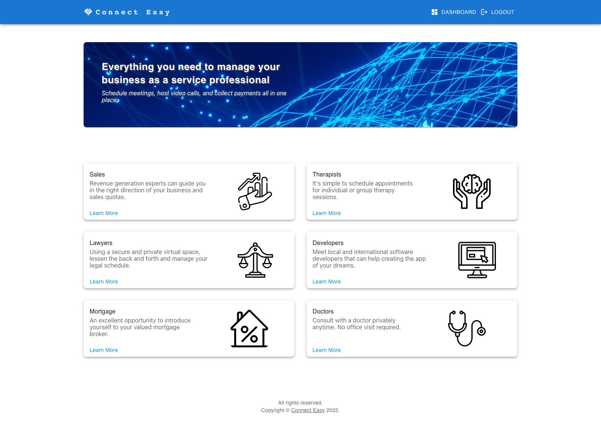
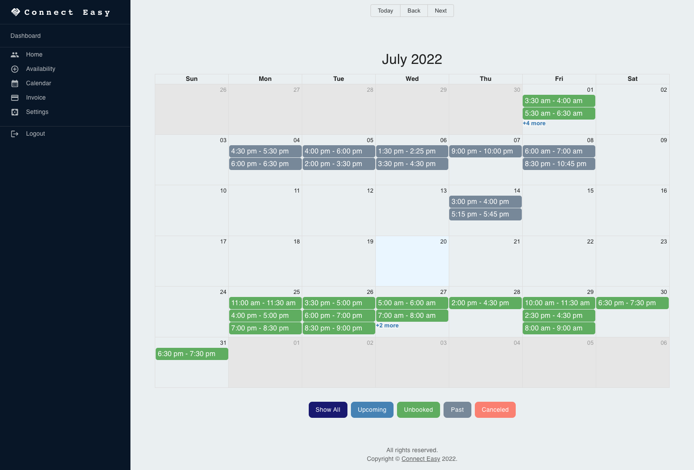
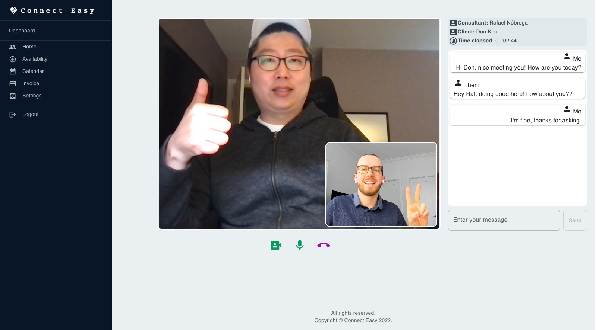
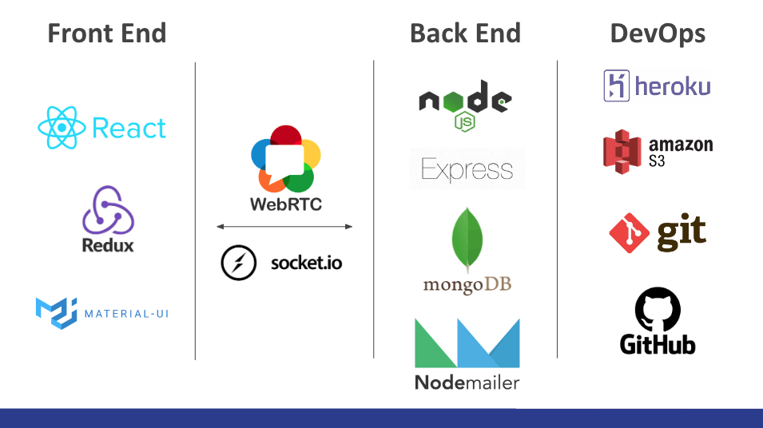

<div align="center">
  
  <h1>Connect Easy</h1>
  

#

If you are a professional offering consultation services, or a client seeking help, 
Connect Easy has everything you need in one place. <br/>
From managing your business as a Consultant, or finding the right consultancy as a Client.<br/>
Schedule meetings, host video calls, and collect payments all in one place. 

## 🤝 &nbsp; Contribuitors:
Dongwan Kim - https://github.com/dongwandonkim <br/>
Iksung Choi - https://github.com/ikchoi0 <br/>
Rafael Nóbrega - https://github.com/rafnobrega <br/>

<a href="https://github.com/dongwandonkim">
  
</a>
<a href="https://github.com/ikchoi0">
  
</a>
<a href="https://github.com/rafnobrega">
  
</a>


<br/>

## 🚀 &nbsp; Final Product

<p align="center">📸 &nbsp; Home Page:<br>
  
</p>
<p align="center">📸 &nbsp; Dashboard:<br>
  
</p>
<p align="center">📸 &nbsp; Video call:<br>
  
</p>

<br/>


## 📚 &nbsp; Stack:
<p align="center"><br>
  
</p>
<br/>

## 🧰 &nbsp; How to Install:

### Frontend:
```
npm install
```


### Backend:
```
npm install
```
Copy the `.env.example`, rename it to `.env`, and modify the following keys:
```
API_PORT=5002
MONGO_URI=
TOKEN_KEY=JWT secret token
accessKeyId=S3 Bucket access key
secretAccessKey=
region=AWS region
FRONTEND_URL=http://localhost:3000/

// Emailer
AUTH_USER2=email address
FROM_EMAIL=email address
AUTH_PASS=password
```
